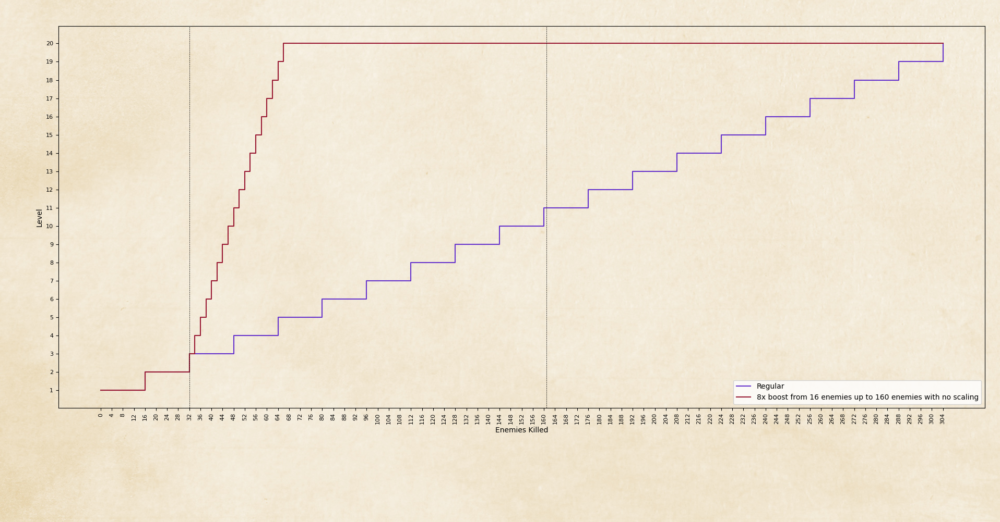
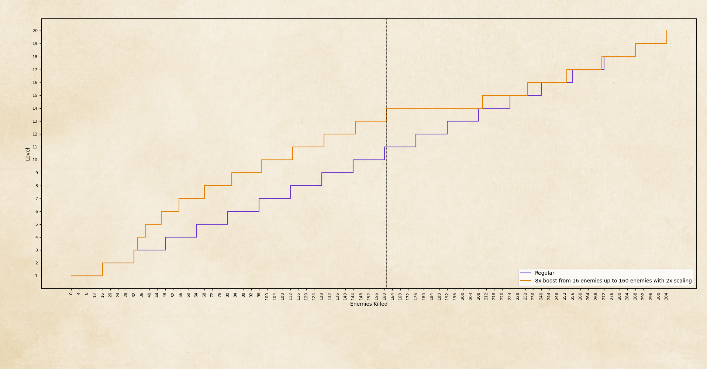
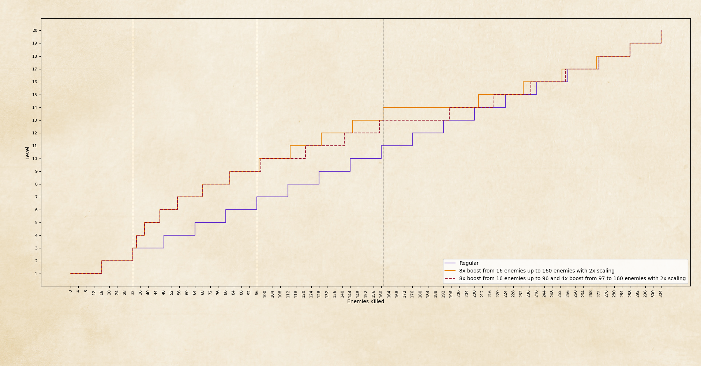
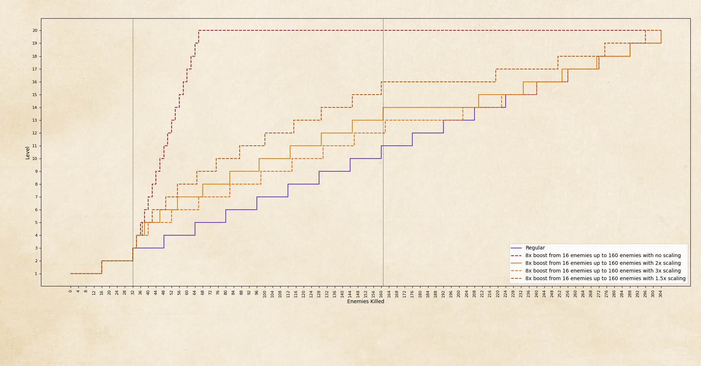

# Shared Experience Setting

A video version of this guide can be found [here](https://youtu.be/T-W8uqmVQHg).

The setting is now called *Only active companions receive experience*, but in this guide and the video, I refer to it as *Shared Experience* for simplicity.

I belatedly realized (only after completing the video guide) that there is a potential point of confusion: semantically, *Shared Experience* **Off** is equivalent to *Only active companions receive experience* **On**.

However, throughout this guide, the term *Shared Experience* refers solely to the user-defined label I’ve assigned to the setting. Therefore, when I indicate *Shared Experience* **Off**, I am referring to *Only active companions receive experience* **Off**. 

## Overview

The Shared Experience setting in *Pathfinder: Wrath of the Righteous* can be found under:

**Options > Difficulty > Only active companions receive experience (on/off)**

This setting does not affect the actual Difficulty level (Normal, Hard, Unfair, etc.) or Achievements.

- **Off (Default):** All companions receive experience, even if they are not in the active party.
- **On:** Only companions in the active party receive experience. If the party size is less than 6, the characters receive increased experience, calculated as:\
  *Total 'off' experience for 6 characters divided by current party size.*\
  (e.g., a party of 3 gets **double XP**, and a solo character gets **6x XP**.) \
\
Newly recruited companions join at a preset base level, which varies per character and matches the 'intended' level of the main character (MC) at that point in the game.

**Important:** You can toggle the setting **Off** before recruiting new companions to ensure they join at the same level as your MC.

## Impact on Prologue and Early Act 1

The ability to toggle this setting before recruiting new companions means there's no downside to keeping it **On** until you have more than 6 companions.

Many players take advantage of this during the prologue and early Act 1. \
\
After the prologue, you can also deliberately leave companions behind and rely on new recruitments or companion leave-and-rejoin events. This guide focuses on strategies for optimizing XP gains by doing exactly that.

## Leveling Mechanics

Characters gain **Experience Points (XP)** by defeating enemies, completing quests and passing skill checks. When a character accumulates enough XP, they level up.

- The XP required to level up **increases** with each level.
- Monster and quest XP scale similarly throughout the game, maintaining a consistent time requirement to level up.

### XP Scaling and Solo/Reduced Party Play

With increased XP gain, we level up faster. However, since monster and quest XP do not scale with character level, leveling slows down over time.

#### Example of XP Scaling:

Imagine a hypothetical game with:

- **20 levels**
- **Max party of 8**
- **Level-up every 16 monsters killed**

If a player gets **8x XP gain** from 32 to 160 monsters killed:

- With **no XP scaling**, they would level up every **2 monsters** and heavily outpace regular leveling.
    
- If level-up costs **double each level**, and monster XP also **doubles every 16 kills**, the solo player initially levels up faster but gradually slows down to match regular leveling. For example, if the first level-up requires 2 monsters, the second level-up will require 4, as monster XP remains constant until 16 kills. Over time, the leveling advantage diminishes as the escalating XP requirements catch up to the player's gain rate.
    
- In this scenario, this happens when we are consistently 3 levels above the intended level. At 3 levels higher, our XP requirements are $2^{3}$ = 8, which matches our boosted 8x XP gain. Meaning we now level up at regular pace.
- When we add back in our companions at 161 monsters killed, we are now higher level **and** back to normal XP gain. This results in a sudden drop in XP progression, making XP gain significantly worse for a while until it approaches 'intended' level. With enough levels this might even result in getting back on the regular curve before the level cap as the extra experience from earlier becomes more and more insignificant.
- We could recruit part of our companions at an earlier point, say 90 monsters killed, this would result in a lower peak advantage but a more stable power level throughout the game.
    
- Our hypothetical game could also have different scaling factors, but the concept is the same. 
    

#### Key Takeaways:

- There is a **peak advantage** to solo XP gain, after which it declines.
- The game becomes harder initially when going solo but easier soon after, before gradually becoming difficult again.
- Reintroducing companions later results in a **massive power spike**, but XP gain plateaus for a while afterward.
- Ideally, you should **recruit after hitting a power spike, not before one.**
- The long-term advantage of solo play is **temporary**, disappearing by level cap or even earlier.

## Easy XP in Act 1

This strategy is viable because Act 1 offers several **easily obtainable XP sources** through quests, many requiring little or no combat.

You can complete these right at the start of the Act, getting a large xp boost when it's gains result in the most levels, for a significant powerspike.

What would have otherwise been a very tough part of the game (going from a party of 4 to 1) 
is now very manageable.

Without these quests, solo play would be extremely difficult and likely not worth it.

### Easy XP Quests

| Quest/Event                      | Combat          | Notes                                                 |
| -------------------------- | --------------- | ----------------------------------------------------- |
| **Stolen Moon**            | No              | Requires recruitment of Woljif Jefto                  |
| **Save Thieflings**        | No              | You can sneak around the center of the Market Square to avoid combat |
| **Feud of the Faithful**   |                 |                                                       |
| ├ (Peaceful)               | No              | Sneak around center of Market Square                  |
| ├ (Kill Ramien)            | Yes (Mid)      | Ramien is doable and route gives more XP (if done optimally)  |
| ├ (Kill Hulrun)            | Yes (Hard)      | Challenging but route grants most XP (if done optimally)    |
| **Starward Gaze**          |                 |                                                       |
| ├ (Help Adepts)            | No/Yes (Hard)   | Can kill Hulrun here for Feud (extra XP)              |
| ├ (Kill Ilkes)             | Yes (Easy)      | Required if killing Ramien                            |
| **Spies Amidst Our Ranks** | Yes (Hard/Easy) | Skill checks and Greybor's help make the fight easier |
| **The Outcast (partial)**  | No              | Just talk to Forn then to Kaylessa                    |

## Companion Recruitment

After recruiting companions, there are two options of what to do with them:

- **Bench them after recruitment:** This keeps them underleveled until a leave-and-rejoin event.  
- **Bring them along immediately:** This leads to XP dilution with Shared Experience enabled.  

Thus you want to make use of a companion early, but don't need the immediate powerspike that comes from increasing party size, delaying recruitment as long as possible is optimal. So knowing the recruitment deadlines is very useful.

### Act 1 Companion Locations and Deadlines

| Companion        | Prerequisite                                   | Recruit Location           | Deadline             |
| ---------------- | ---------------------------------------------- | -------------------------- | -------------------- |
| **Nenio**        | Leave Market Square                            | Special Encounter (forced) | Special Encounter    |
| **Woljif Jefto** | Visit Dungeon, then talk to Irabeth            | Tavern Dungeon             | Before Tavern Fight  |
| **Ember**        | -                                           | Market Square              | Before Gray Garrison |
| **Daeran**       | Encounter Messenger near NW Market Square exit | Arendae Party House        | Before Gray Garrison |
| **Ulbrig**       | Blackwing Library + Talk to Storyteller        | Tavern (forced cutscene)   | Before Gray Garrison |

### Act 2 Companion Locations and Deadlines

| Companion  | Prerequisite     | Recruit Location | Deadline                              |
| ---------- | ---------------- | ---------------- | ------------------------------------- |
| **Sosiel** | Speak to the Queen at the camp             | Act 2 Camp       | Speak to the Queen cutscene            |
| **Regill** | Help Hellknights | Gargoyle Cave at Reliable Redoubt   | Lost Chapel? (Didn't check)            |

While I haven't checked how long you can delay going to Reliable Redoubt, the timing is largely irrelevant; if you aren't taking Regill for Leper’s Smile, you'll likely only want him at/past Lost Chapel anyway, so you might as well recruit him right away.

### Act 2 and 3 Companion Rejoin Locations

Several leave-and-rejoin events provide opportunities to bring previously benched companions up to the main character’s level.

| Companion(s)            | Prerequisite                           | Rejoin Location                                         |
| ----------------------- | -------------------------------------- | ------------------------------------------------------- |
| Lann, Regill, or Sosiel | Choose during Leper's Smile book event | Leper's Smile after Vescavor Queen fight                         |
| All but Woljif          | -                                   | Act 2 Camp and Lost Chapel during Strike from the Sky   |
| Woljif                  | (Begin Act 3)                            | Crescent of the Abyss Special Encounter north of Drezen |

## Some Solo Viable Build Types

### Act 1, 2, and Beyond  

#### The Well-Rounded Mounted Gish  

This character remains unmounted until level 7, as a **more tanky animal companion** is generally preferable over a horse. The goal is to cover all essential roles in a single character.  

##### Desirable Features:    
- **Animal Companion as a Tank** – Enables *Outflank* and provides frontline, allowing the MC to focus on offense.  
- **A Spell List with Strong Buffs** – Buffs are crucial for any build in *Wrath of the Righteous*.  
- **Melee Combat Class Features** – Melee combat is **less feat-intensive**, making it better early, especially for gish classes, which have fewer feats than full martial characters.  
- **Hexes** – *Protective Luck* significantly boosts the animal companion’s survivability.  

##### Recommended Classes:  
(All of these are 3/4 BAB classes with full choice of Animal Companion from level 1)
- **Wildland Shaman** – Likely the best choice as it's the only option with **Hexes**. Also a **full divine caster** with a strong buffing spell list.  
- **Oracle (Nature Spirit)** – Another **full divine caster** with excellent buffs.  
- **Sacred Huntsmaster** – A **half-caster** with a good spell list, solid combat features, and access to domains.  
- **Hunter** – Also a **half-caster**, very front-loaded both in class features and the spell list. Weak lategame.

For a **full solo run**, *Merged Angel* is an option, but it requires a **full divine caster**; meaning *Wildland Shaman* or *Oracle* are the only viable choices of these 4. 

#### The Vital Strike Stealth Cheese Archer

This build abuses **Vital Strike** together with **Move Action Stealth** to remain undetected while dealing damage. *Witch of the Veil* can use full attacks instead,
**Vital Strike** merely makes it safer/easier. 

##### Core Mechanics:  
- **Vital Strike** – A single high-damage standard action attack per turn.  
- **Move Action Stealth** – Required to re-enter stealth every turn to stay undetected.  

##### Class Options:  
- **Witch of the Veil** (*Earliest access*)  
  - Gains *Shrouded Step* (Swift Action Invisibility) at **level 2**.  
- **Forester Ranger**  
  - Gains *Camouflage* (In-Combat Stealth in Favored Terrain) at **level 7**.  
- **Ranger (Non-Forester)**  
  - Gets *Camouflage* at **level 12**.
- **Cult Leader Warpriest**  
  - Gains *Hide in Plain Sight* (In-Combat Stealth) at **level 12**.
- **Assassin**  
  - Gains *Hide in Plain Sight* at **level 5**.
- **Slayer**  
  - Can pick *Slayers Camouflage* as a Advanced Slayer Talent (lvl 10+).  

Apart from *Witch of the Veil* these are all too late for early act 1. 
*Forester* is an option if you are able to solo till level 7 without it (doable).

Many full solo *Witch of the Veil* runs exist, though I haven’t personally looked into it at all. 

*Shrouded Step* is obviously an outlier power wise, I believe this was a deliberate design decision to facilitate a certain fantasy/playstyle without it impacting the 'regular' game too much.

I assume the key to making it work is **initiative stacking** and a plan for enemies with **True Seeing** lategame. But don't take my word for it.

### Early Act 1 Only  

#### The Kiter  

A **ranged** build focused on **kiting enemies** by leveraging high **movement speed** and **Vital Strike** (optional if mounted).

##### Why It Works in Early Act 1:  
- **Large Maps** – *Market Square* is the primary example. It’s even possible to kite ranged enemies here.  
- **Enemies Lack Haste Early On** – The only exception is the *Market Square Necromancer*.  

##### Key Equipment:  
- **Dark Veil** (*Sold by the Hawkes at the Tavern*)  
  > Grants total concealment against ranged attacks for 1 minute (1/day).  
  - Useful in forced encounters where kiting ranged enemies isn’t possible due to limited space (*e.g., Nenio’s recruitment*).  

##### Example Builds:  
- **Any (Horse) Mounted Archer Build** – The mount’s speed allows for kiting.  
- **Forester Ranger with Vital Strike** – My current build. Uses *Longstrider* for speed, or *Animal Focus: Stag* if *Longstrider* isn’t unavailable/had no time to buff.  

This strategy **only works in early Act 1**; eventually one is forced to do encounters that you can't kite due to limited space.

## Post-Prologue XP gain maximization Strategies

#### 1. **Maintaining the Shield Maze Party (Default)**

- We keep our Prologue party

- Recruit companions as they come

- Turn off *Shared Experience* once we have 6 members, leaving **no underleveled companions**.

- Can be done with **any build**.

##### Optimized:

- **Delay companion recruitment as much as possible:**

- Atelier and Tower of Estrod before Market Square, but not Woljif's quest as we want to delay his recruitment.

- Explore as much of Market Square as possible before advancing further. Consider siding with Hulrun to complete Feud of the Faithful and Starward Gaze without leaving Market Square.

- Upon leaving Market Square, recruitment of Nenio is forced.

- Continue progressing as far as possible before being called back for the Tavern Fight; this is the last chance and thus optimal time to recruit Woljif.

- We now have a party of 6 and can keep *Shared Experience on* for the rest of the game.

#### 2. **Using Only New Companions**

- Leave all companions behind after Shield Maze.
- Delay recruitment of additional companions if able.
- There's 5 new companions in Act 1 so we've a full party by the end of it.
- Our Shield Maze companions remain underleveled, but we can eventually have them leave and rejoin during the **Strike from the Sky**.
- Can't be done with any build, as you at least need to be able to beat the Nenio encounter.

#### 3. **Solo Until Gray Garrison**

- Leave all companions behind after Shield Maze.
- We can do **Stolen Moon** right away as won't be using Woljif until he rejoins in Act 3.
- Recruit **Ember, Ulbrig, and Daeran** just before Gray Garrison.
- We have everything important **except Haste**.
- **Daeran** will trivialize the **Minagho** boss fight.
- While I personally did not find Gray Garrison hard solo (as this is around our level advantage peak) some builds might struggle with Minagho without Daeran.
- Recruit **Regill and Sosiel** as normal, you can't delay the latter and Regill is just before Leper's Smile anyways.
- This will arguably have us stronger than option 4 for the **Gargoyle Cave** and **Vescavor Queen** due to limited recruitment before these fights in Act 2.
- We can have **Lann** leave and rejoin after the Vescavor Queen fight. We probably drop Ulbrig or Regill as they share a similar role. 
- We will have our whole party leave and rejoin during the **Strike from the Sky**. 

#### 4. **Solo Until Act 2**

- Similar to option 3 but solo all of Act 1 including the Gray Garrison.
- Recruit **Regill and Sosiel** before Leper's Smile. **Lann** after the Vescavor Queen fight.
- We will have our whole party leave and rejoin during the **Strike from the Sky**.

#### 5. **Solo Until Lost Chapel**

- Maximize XP gains by staying solo until Act 2's **Strike from the Sky**.
- Strongest possible power spike for Lost Chapel and Drezen fights.
- Vescavor Queen fight and Leper's Smile Caves might become major hurdles.

### Choosing the Best Strategy

There is no universally best option; choices depend on:

- **Character build and power spikes.**

- **Tough encounters** you want to prepare for (e.g., Vescavor Queen).

- **Option 1** works for all builds.

- **Options 3-5** require solo-specialized characters that might be worse once xp normalizes in a full party in the very late game.

- A version of **Option 2** might work for some builds that can't handle 3-5.

- One can also **use new companions temporarily** or **hire mercenearies** (if one has the funds) for a single hard fight before going back to solo.

IMO: **The goal of Maximizing XP gains is to try manipulate your parties power to peak at critical hard fights.**

## Extra: Cheesing The Other

Lately oft mentioned on Reddit. As it makes use of shared experience toggle I decided to include it.

### Encounter Overview  

After visiting Heaven’s Edge and uncovering the truth about him, you can choose to confront Daeran at any time in camp. This confrontation triggers a solo fight between your main character and the Other.  

Defeating the Other grants **184,320 XP**, if you disable shared experience, this increases to **1,105,920 XP**.

For reference, when testing this on a solo character save, this XP jump took my character from **level 12 to level 17**, gaining five full levels. A lower-level character would gain even more.  

Since you visit Heaven’s Edge shortly before *Lost Chapel*, the idea is to trigger the fight just before it so you can then bring all companions up to this level. 

### The Fight  

**Difficulty:** [Near impossible]().  

- The Other has **extremely high AC** and **Saves**
- It is immune to most forms of damage and effects.
- This includes being **targeted by spells**.  
- Its **Spell Resistance (SR) is so high** that no spell affected by SR will land.  

However, there is a way to defeat it.  

### The Strategy  

The key is the **Disruption Nunchaku**, available for purchase from the Skeletal Salesman.  

**Disruption Weapon Trait:**  
> Any undead creature struck in combat must succeed on a **DC 14 Will save** or be instantly destroyed.  

Despite all it's many immunities, the Other is undead and thus **vulnerable to this effect**. However, there are two major obstacles:  

1. **You need to hit** – Given the Other’s AC, this requires rolling a natural 20.  
2. **It needs to fail its save** – With its high Will save, this only happens on a natural 1.  

This means the odds of success per hit are:  
- **1 in 400**  
- With **Fortune Hex**, this improves to slightly worse than **1 in 200**.  

Unfortunately, the Other will kill or incapacitate the MC long before these odds play out naturally. As it is, this strategy demands **an extreme number of reloads or sheer luck**.  

### Mitigating the Other’s Spells  

However there is a way to survive indefinitely:  

**Magic Nullification (Mythic Ability)**  
> Removes all effects on you and grants immunity to spells.  

Since the Other relies entirely on spellcasting (as far as I can tell, it's possible he runs out of spells), this makes you functionally **unkillable** in this fight. All that remains is waiting for the 1-in-400 roll.  

### Costs and Trade-Offs  

- **Daeran dies** – You lose a powerful and entertaining companion.  
- **Magic Nullification is a weak mythic choice** – While situationally useful, losing all buffs makes it suboptimal for most encounters.  
- **Nunchaku Weapon Proficiency is required** – To wield the Disruption Nunchaku, you must either:  
  - Take a **Monk level**, or  
  - Spend a feat on **Exotic Weapon Proficiency: Nunchaku**.
